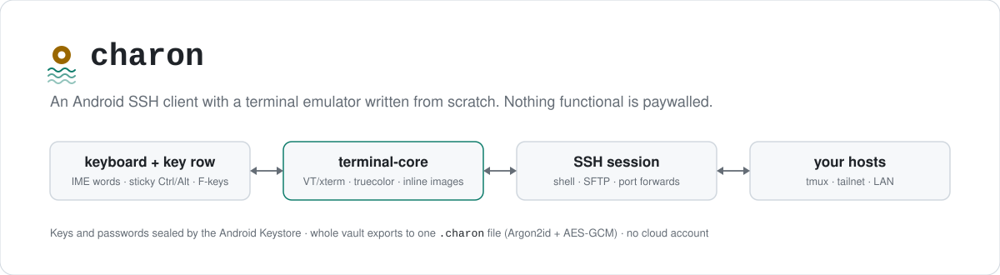

<p align="center">
  <picture>
    <source media="(prefers-color-scheme: dark)" srcset="assets/hero-dark.svg">
    
  </picture>
</p>

<p align="center">
  <a href="https://github.com/CocaKova/charon/releases/latest"></a>
  
  
  <a href="LICENSE"></a>
</p>

Charon is a native Android SSH client. Phone SSH apps often charge for the basics: unlimited
hosts, SFTP, snippets, port forwards, key management. In Charon all of that is free, and there
is no account or cloud sync to sign up for.

Most of the work went into the terminal. The emulator in `terminal-core/` is written from
scratch in plain Kotlin, tested on the JVM against recorded vim, htop and tmux sessions, and
paired with a key row that makes Ctrl, Alt, arrows and F-keys usable on a touch keyboard.
Charon speaks in river terms (hosts are *moorings*, connecting is a *crossing*); the
[guide](docs/GUIDE.md) gives the plain name next to each one.

## Install

Download the APK from [Releases](https://github.com/CocaKova/charon/releases/latest) and
sideload it. Releases from v1.0.0 on are signed with the same key, so later versions install
over the top and keep your hosts. Builds before v1.0.0 were debug-signed: export your vault,
uninstall, then install the new one and import.

Then read [the guide](docs/GUIDE.md). It covers the first connection and host-key check, keys,
the terminal, autocomplete, files, port forwards, notifications and vault export, plus a
troubleshooting section.

## Features

These are in the current release (v1.1.2).

| Area | What you get |
|---|---|
| Terminal | VT/xterm emulation with truecolor, mouse reporting, bracketed paste, scrollback with selection, search in scrollback, pinch-zoom, per-session color schemes. Conformance notes in [`docs/TERMINAL.md`](docs/TERMINAL.md). |
| Inline images | Kitty graphics protocol and iTerm2 `imgcat`, drawn in the grid and scrolling with the text. Tap one for a full-screen viewer with zoom, save and share. |
| Keyboard | Accessory row with sticky or locked Ctrl/Alt, long-press variants, auto-repeat and F-keys. An "abc" mode for the phone keyboard's words and a "raw" mode for vim and friends. The terminal is exposed to dictation and accessibility services. See [`docs/INPUT.md`](docs/INPUT.md). |
| Autocomplete | Command grammar plus probes of what is installed and running on the host (tmux sessions, docker containers, systemd units, remote paths). A prose gate and a secret gate keep it from learning your sentences or your tokens. |
| Password prompts | Detected, and keystrokes typed into them skip the suggestion strip, the keyboard's learning and command history. |
| Sessions | Several at once. A foreground service keeps them alive in the background, with auto-reconnect, a redial as soon as the network comes back, per-host startup commands (for example `tmux new -As main`), and keepalive stretched from 30 s to 120 s while the app is in the background. |
| Hosts | Groups, per-host colors and quick actions, a reachability probe every 25 s while the host list is open. Bulk import from `tailscale status` (run over an existing connection) or a port-22 sweep of your Wi-Fi /24. |
| Keys | Generate Ed25519 keys on the phone or paste an OpenSSH private key. Secrets are encrypted with AES-GCM under non-exportable Android Keystore keys; a key can be gated behind a fingerprint, enforced by the keystore hardware. Host keys are pinned on first contact and a changed key is refused. |
| Files | SFTP browser with resumable transfers. Text files open on the phone without downloading (markdown rendered). |
| Port forwards | Local, remote and dynamic (SOCKS5). |
| Snippets | Saved commands, global or pinned to one host, shown as chips on the suggestion strip when the command line is empty. |
| Notifications | A notification when a long command finishes while you're away (OSC 133). Shell setup in [`docs/HORN.md`](docs/HORN.md). |
| Vault export | Hosts, keys, known hosts, snippets and forwards in one passphrase-encrypted `.charon` file (Argon2id + AES-GCM). Format in [`docs/VAULT_FORMAT.md`](docs/VAULT_FORMAT.md). |

### On `main`, not yet released

- Kitty keyboard protocol (flag stack per screen; Ctrl+I is not Tab, Esc is not Alt)
- Underline styles and colors (`SGR 4:n`, `58`/`59`)
- OSC 8 hyperlinks: a dotted underline, and a tap opens a sheet that shows the real target before anything opens
- OSC 7: with the shell setup from `docs/HORN.md`, autocomplete completes relative paths and git branches from the directory you are in
- A search key on the accessory row
- A fix for words replaced by the keyboard's prediction (seen with Samsung's keyboard on Android 14+) never reaching the host

## The Obol

The Obol is a separate build flavor for cosmetic extras, made from a private source tree that
is not in this repository. The public build (`foss`) is the whole app and has no locks,
upsells or in-app purchases. Nothing functional will move behind the Obol.

## Limitations

- A personal project, developed and tested on a small number of phones against Linux hosts.
  Other devices, keyboards and Android versions have seen less use. Bug reports are welcome
  in [Issues](https://github.com/CocaKova/charon/issues).
- No jump hosts (`ProxyJump`), no SSH agent forwarding, no X11 forwarding, no mosh. Per-host
  startup commands with tmux are the substitute for mosh.
- Keys are Ed25519 when generated in the app. Legacy encrypted PEM keys need converting first
  (`ssh-keygen -p -f key -o`).
- Sessions can still be killed by aggressive battery optimization. The guide's troubleshooting
  section covers the exemption.
- Only distributed as an APK on GitHub Releases.
- Provided as is, with no warranty beyond what the license says.

## Building

Needs JDK 17 and the Android SDK (compile SDK 36).

```sh
./gradlew :terminal-core:test      # emulator test suite, pure JVM
./gradlew :app:assembleDebug
```

Release signing reads `charon.keystore`, `charon.keystore.password`, `charon.key.alias` and
`charon.key.password` from `local.properties`. Without them, release builds fall back to the
debug keystore. `tools/remote-gradle.sh` and `tools/sign-release.sh` are helpers for building on
another machine and signing locally.

## Authorship

Charon is written and maintained solely by [CocaKova](https://github.com/CocaKova).

## License

[PolyForm Noncommercial 1.0.0](LICENSE). You can read, build, use and share Charon for any
noncommercial purpose. Selling it or shipping it in a commercial product is reserved to the
author. The bundled JetBrains Mono font is under the [SIL Open Font License](licenses/JetBrainsMono-OFL.txt).
